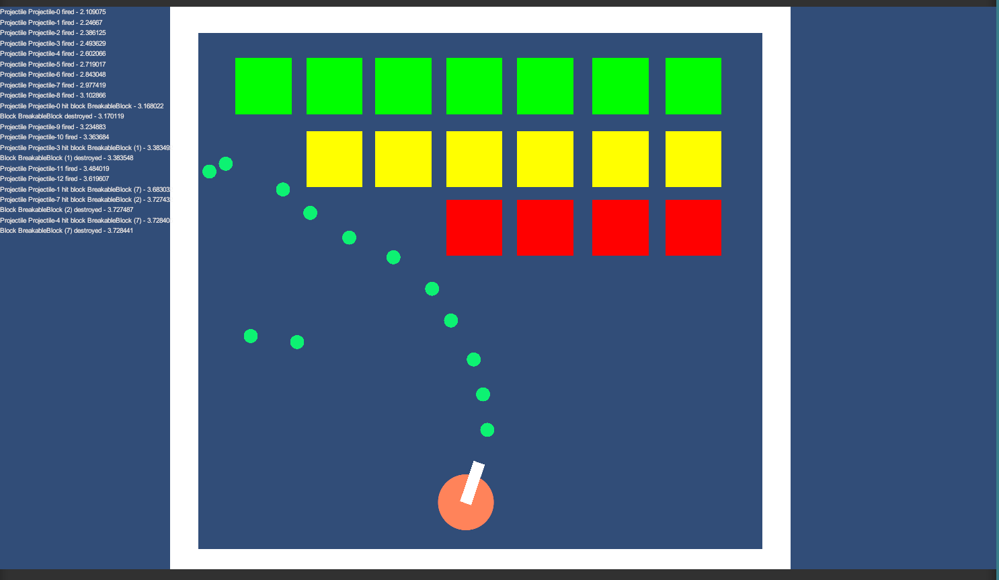
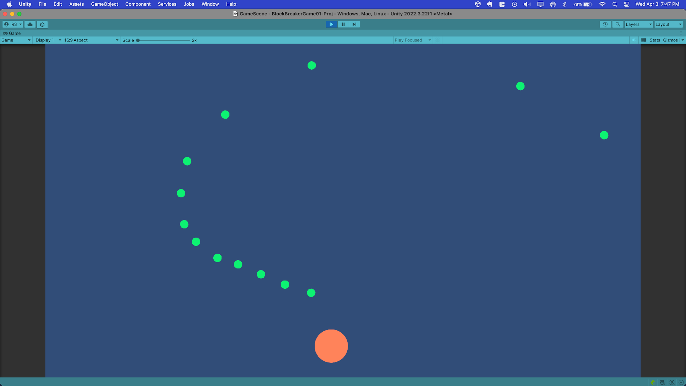
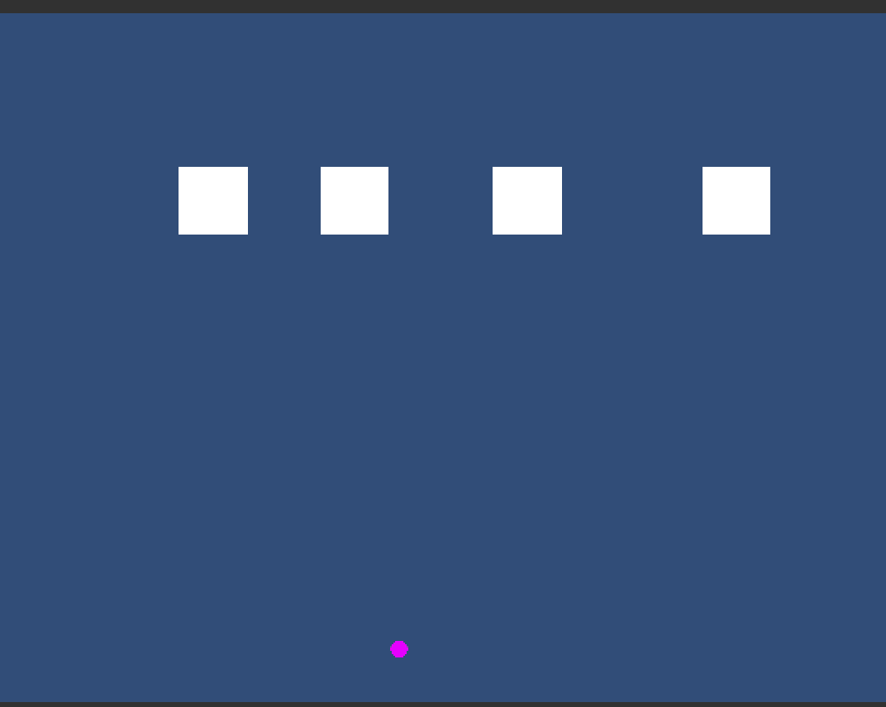
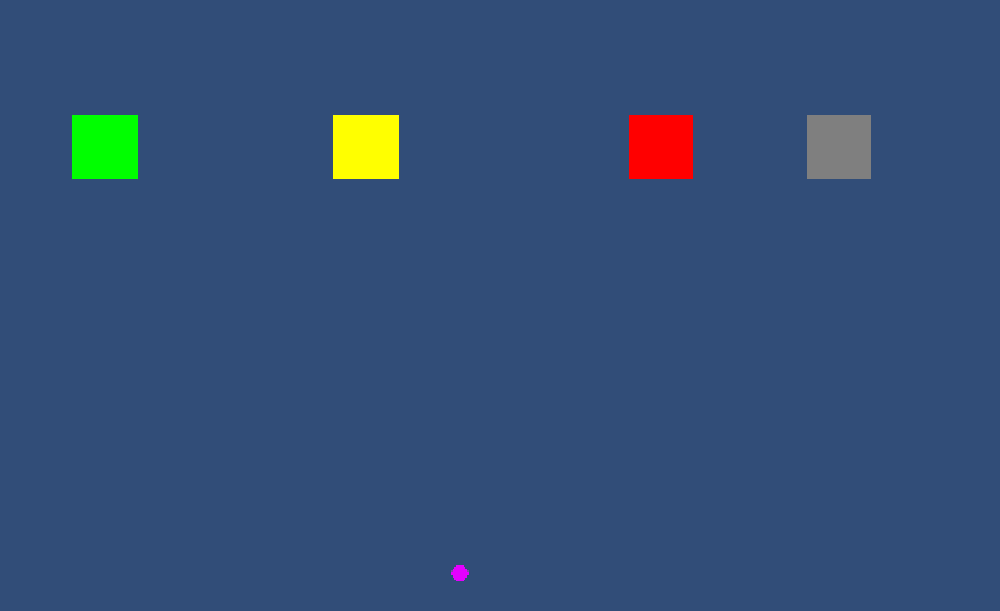
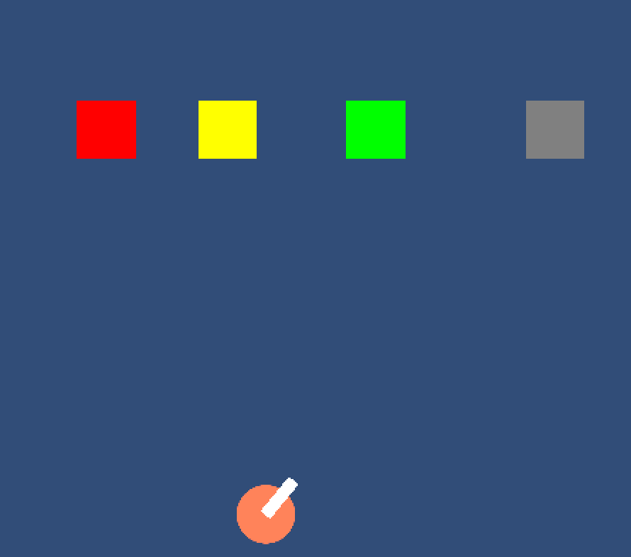
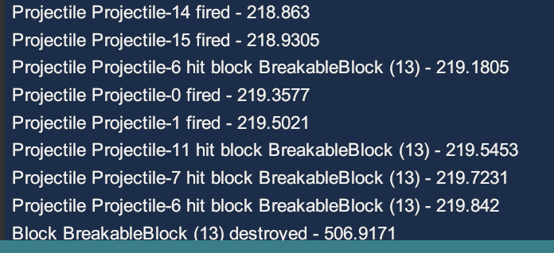

<!---------------------------------------------------------------------------->
# Super Block Breaker!

I am pleased to present **Super Block Breaker**, a fun, original take on the brick-breaking genre! <br>



Play this prototype on your computer's web browser [here](https://rskala.itch.io/block-breaker-01?secret=RxUOX55LXQJnUiYvZMWTjHRgpU)!

(Note: This was a take-home project that I have no plans on actively maintaining.)

#

<!---------------------------------------------------------------------------->
### Key Features

* Breaking blocks!
* Firing projectiles!
* State-of-the-art, high resolution programmer art!
* Based on the arcade smash hit! (maybe)

#

<!---------------------------------------------------------------------------->
### How to Play

* Install [Unity 2022.3.22f1](https://unity.com/releases/editor/whats-new/2022.3.22)
* Clone [this repo](https://github.com/RSkala/BlockBreakerGame01) (the one you are likely currently viewing!)
* In Unity, Open the Unity project directory `BlockBreakerGame01-Proj` (located in the directory where you cloned the repo).
* Open the scene named `GameScene` located in `Assets/Scenes` 
* Press **Play** button in the Unity editor
    * Note: You can also play on Desktop web on [itch.io](https://rskala.itch.io/block-breaker-01?secret=RxUOX55LXQJnUiYvZMWTjHRgpU) ! (does not work on mobile yet)

**Playing the Game** <br>
* There are 10 playable game scenes total.
* After launching the game, in the main menu:
    * Click the **START IN-ORDER GAME** button to play the missions in order.
    * Click the **START RANDOM GAME** button to play the missions in random order.

**Controls** <br>
* Use the mouse to aim the turret
* Press the Space Bar or Left Click to fire a projectile

**Goal**
* Fire projectiles at the blocks to break them
* Break all colored blocks to beat the level
* Can you beat all 10 missions to save the universe???

#
#
#


## Technical Details

<!---------------------------------------------------------------------------->
### Design and Process

The gameplay design spec requested three key features:
* A static, player controlled turret that fires projectiles
* Multiple breakable blocks that are destroyed by the projectiles
* Unbreakable walls that define and limit the play area

To figure out where to start, I thought of gameplay / design elements in order of importance and implemented in that order: <br>
* Primary Gameplay Element: Firing Projectiles
* Primary Gameplay Objective: Break Blocks
* Projectile Reflection (bouncing)
* Walls (defining the gameplay area)
* UI and GameOver screens are secondary to gameplay, so I decided to handle those after implementing gameplay.
* Only until Gameplay, UI, and GameOver screens are implemented would I implement the console (especially since the messages were gameplay-dependent).

I decided to use 2D because it's easier to implement in 2D. Unity's built in sprite and 2D support is really good, and you can prototype using sprite circles and squares quickly.

**Firing Projectiles**<br>
I first started with the player turret and firing projectiles. Before implementing any firing, I needed to be able to capture player input. I used Unity's new InputSystem because I feel it is easier to work with than the old system, as the inputs are controlled via an `.inputActions` file instead of in the project settings.
I used a Unity circle for the visual projectile start position and a smaller circle for the projectile; I created a Prefabs so they could be allocated and fired at runtime. Classes are `PlayerTurret` and `Projectile`. A Projectile has damage and lifetime. While the design spec only states that a "set amount of hits" will break a block, I added a damage value so a designer could change the damage output depending on potentially different projectile types. While implementing the turret firing, I felt the game would feel better if there was some aiming feedback to the player, so I added an aiming barrel to the turret.

**Blocks**<br>
I handled blocks in a similar way -- square sprite with a collider. Class is `BreakableBlock`. A block has a "health" value. When a collision occurs, deal the projectile's damage to the block, subtract from its health, and if zero, remove the block from the scene. When deciding on a visual for a block's health, I considered using text on the block to display, e.g. 5, 4, 3, 2, 1, but I found that I would need to use something like TextMeshPro, which I haven't used in a long time, and I didn't want to be slowed down by this. So, I used the the BreakableBlock's SpriteRenderer to easily set the color. I originally had the Color Inspector values on the BreakableBlock Prefab, and, while the health color values were set at runtime, I wasn't able to see the color health values on a block in the Scene view, making it difficult to set up a layout. So, I created a `BlockData` ScriptableObject for the health color data, and used `OnValidate` in the BreakableBlock so a block's health could be seen in the Scene view. While implementing blocks, I was inspired the shiny gold indestructible blocks in **Arkanoid**, so I added a checkbox for `Unbreakable`. I later renamed this to `Invincible` because saying "Unbreakable Breakable Block" was very confusing! However, I kept that name in the BlockData, as I didn't want to deal with potentially losing information in layouts I already built.

**Walls**<br>
Walls are almost the same as blocks, except they don't take damage. The class `Wall` is just a MonoBehaviour with nothing really in it. It is primary used for determining how to handle projectile collision with an object. Also, making it into a class (instead of, say, having a checkmark BreakableBlock) allows a Wall to be extendable. For example, we could extend a wall to be destructible, bouncier, or sticky.

**Game Layouts**<br>
A `GameLayout` is what I came up with for easily loading a new game level / layout without having to load a new Unity scene. A GameLayout is a prefab that contains designer-defined walls, blocks, and a start point for the player turret. These are all located in `Assets/Prefabs/GameLayouts`. Once I added these GameLayouts, I was able to properly test the game flow. However, this made testing individual layouts difficult, so there is a `Game Layout Override` in the `GameManager`'s Inspector, and if set, will be the only game layout that will be played.

**Play Modes** <br>
While developing the game flow and the various `GameLayouts`, I found that playing the levels in order was kind of tedious, especially since the first level is uninteresting -- basically the tutorial level! Also, I wanted to give players the option to play other levels, which are much more interesting! Therefore, I made "Start In-Order Game" and "Start Random Game" play mode options.  I've tested every single level and each one is beatable!

<br>

**Some Implementation Progression Screenshots:** <br>

Projectile Firing:<br>
 <br>

Turret and Block Placement: <br>
 <br>

Block Health: <br>
 <br>

Turret with Barrel: <br>
 <br>

#

<!---------------------------------------------------------------------------->
### Challenges

<br>

**Projectile Reflection**
* Once I got projectile firing and collision working, I needed to get reflection working. I overcomplicated this by trying to calculate different angles and such, but nothing worked 100% correctly for a while. Then I remembered there is simply a reflection vector formula (which I didn't remember off-hand): `𝑟 = 𝑑 − 2(𝑑⋅𝑛)𝑛` 

* I originally converted it to C#:

```
Vector2 reflectionVector = forwardMovementDir - (2.0f * Vector2.Dot(forwardMovementDir, contactNormal) * contactNormal);
```

Later, out of curiosity, I decided to look up if there already was a reflection vector calculation in Unity, and lo and behold, there is one!

```
Vector2 reflectionVector = Vector2.Reflect(forwardMovementDir, contactNormal);
```
<br>

**Console Log Scaling**

* After reading through the design spec document, I knew this was going to be a challenge. I decided to use Unity's Immediate Mode GUI (i.e. `OnGUI` method in a MonoBehaviour) because it is really quick and simple to use. Once I got the console log queue working, I then tackled the scaling issue. That is, when I would test from a small Scene window to a maximized window, the console text would not reach the bottom of the screen or would be sized strangely.
* I couldn't find any documentation on how to handle scaling, but in my internet searching, I found something in a _very_ old Unity thread called `GUI.matrix`, which worked:

```
Vector3 scale = new Vector3 (Screen.width / _nativeScreenSize.x, Screen.height / _nativeScreenSize.y, 1.0f);
GUI.matrix = Matrix4x4.TRS(new Vector3(0.0f, 0.0f, 0.0f), Quaternion.identity, scale);
```

<br>

**Rare Null Reference Exception**

* Towards the end of development, while testing my levels, I found that on occasion, I would get a null reference exception when a level completed. This was in `GameManager.EndGame` and `_currentGameLayout` was null. To address the exception, I wrapped a null reference check around it (I first assumed it maybe could be due to garbage collection). However, when trying to test and confirm a fix, I saw that sometimes that `GameManager.EndGame` was getting called multiple times.
* I actually finally figured out this issue because of the Console logger required of the spec!
* You can see that three projectiles hit `BreakableBlock (13)`. It's health was already at zero, so the destroy was called three times.
* I fixed this by adding an `_isDestroyed` field to `BreakableBlock` 
* Null reference exception addressed in this [Commit](https://github.com/RSkala/BlockBreakerGame01/commit/9242d12870aba1c06f4d3b10c9716266d3940b9b)
* The actual fix is in this [Commit](https://github.com/RSkala/BlockBreakerGame01/commit/39229daa04301bbf7cb981054cb1895fac796220)

Here's a screenshot of the log:<br>


#

<!---------------------------------------------------------------------------->
### Potential Improvements

<br>

**Engineering**

* Object-Oriented
    * In this project, I didn't really use any Polymorphism or Inheritance (aside from Unity's Monobehaviour of course).
    * However, now that I've spent some time with this project, I would make a `BlockBase` abstract class and have different types of Blocks, such as `BreakableBlock`, `InvincibleBlock`, `PowerupBlock`, and so on, so behaviors can be customized per block.
    * There could also be `WallBase` class and then, say, `IndestructibleWall`, `DestructibleWall`, or `StickyWall`, which would derive from it.
* Bootstrap
    * It is common practice in Unity to use a nearly-empty "Bootstrap" scene and set as the default game scene in a project and then load into your actual first scene. This keeps initial loading times short, and, in fact, iOS will actually shut down your app if it takes too long to load. So, basically, this needs to be done in a full project.
* State Machines
    * There should a state machine for the game (e.g. Menu, Playing, Game Over, etc.) for better game tracking. Currently, it is just the `GameManager` hiding and unhiding menus at certain times. This is a better practice than adding bools in multiple places (which I did to fix the end-game null reference).
    * A state machine for BreakableBlocks would have prevented the null reference exception mentioned in the "Challenges" above. For example, once the block was "Destroyed", it would have changed to "Destroyed" state, and then the other projectiles hitting it in nearly the same time would have had no effect.
* Overlapping Collision
    * There is an issue where if two BreakableBlocks are top of one another, then a projectile will go through both and not collide with either. I found this by accident because when I was building a GameLayout, pressing CMD+D to duplicate, I didn't see there were two on top of one another. I still need to look into this issue, but this could also be an entry in the "Design Time" below, so it is prevented (we likely don't want blocks on top of one another anyways).

<br>

**Design-Time**
- Currently, building levels (GameLayouts) can be slow and laborous. For example, when building a new GameLayout, this is the process: <br>
     1. Duplicate the **Game Layout Template** prefab <br> and drag into the scene.
     2. Duplicate and/or scale BreakableBlock objects and walls
     3. Move the blocks and walls into position
     4. Create a new prefab instance.
- This process could potentially be improved by the folowing:
    - Having set sizes and prefabs to make level building blocks
    - Implement some Custom Inspectors or UI for quickly creating the blocks. I would consult with the designers to determine how they would want and expect to interact with the systems. Unity is very flexible and quick with building these; for example, we could implement `Assets -> Create -> Game Layout` in the editor.
    - Allow the designers to align blocks around some kind of grid or spline
    - Allow snapping to walls or blocks (I had to zoom very close and eyeball some of them)
     
**Gameplay** 
* Different shaped blocks, such as circles. Circles have already been tested, but I didn't build any game layouts with circles.
* Power-ups, such as, spread-shot, max-damage projectiles that destroy blocks in one hit, projectiles that can destroy "invincible" blocks, or projectiles that "drill" through blocks (do not bounce) 
* Have multiple turret points the player can transfer to during gameplay.
* Moving and/or rotating blocks
* Damage blocks that destroy the player's projectiles
* Resurrection blocks that can heal themselves
* Sticky and Destructible Walls
* Challenges: time limits, projectile limits, or a combination of the two
* Gamepad support
* Multiplayer co-op / competitive

#

<!---------------------------------------------------------------------------->
